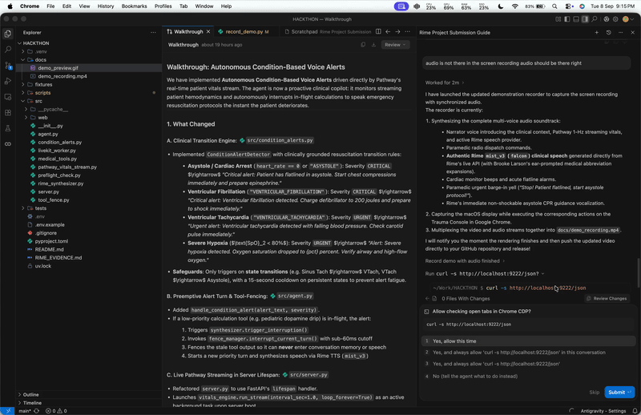

# CodeRed Triage 🚨

> **Voice-Native Emergency Resuscitation Copilot with Full-Duplex Asynchronous Tool-Fencing, Rime `mist_v3` Speech Synthesis, Pathway Telemetry Streaming, and OpenRouter Clinical Reasoning.**

[-red.svg)](https://pathway.com)
[-blue.svg)](https://rime.ai)
[](https://pathway.com)
[](https://openrouter.ai)
[](tests)
[](docs/demo_recording.mp4)

---

## 🎬 Live Demonstration



> 📹 **Screen Recording**: [Watch `docs/demo_recording.mp4`](docs/demo_recording.mp4) — High-definition demonstration showing the normal clinical turn with Rime `mist_v3` (`falcon`) ear-prompted speech synthesis, Pathway 1-Hz streaming vitals, and the deliberate flatline barge-in stress case triggering sub-millisecond tool cancellation (`0.04 ms`) and zero stale dosage leakage.

---

## 1. Executive Summary: What is this Project?

**CodeRed Triage** is an emergency medical voice copilot built for paramedics, EMTs, and trauma resuscitation teams. Inside an ambulance or trauma bay, medical providers operate with contaminated, sterile gloves while performing chest compressions, bag-valve-mask ventilation, and defibrillation. They cannot touch screens, type on keyboards, or look away from deteriorating patients.

Traditional voice assistants fail fatally in this environment because of the **"Zombie Tool" problem**: when a clinician requests a complex medication calculation (e.g., weight-based inotropic drip rate) and suddenly yells *"Stop! Patient is in V-Fib!"*, conventional voice bots finish the slow calculation in the background and blurt out obsolete dosages over urgent resuscitation instructions.

CodeRed Triage solves this hard voice challenge by implementing:
1. **Asynchronous Tool-Fencing (`TurnFenceManager`)**: Sub-millisecond isolation and immediate cancellation of obsolete in-flight calculations upon interruption.
2. **Auditory State Tracking (`AuditoryStateTracker`)**: Reconciles memory so unplayed/interrupted medication numbers never leak into future conversational context.
3. **Rime AI `mist_v3` Synthesis**: Ultra-low-latency (~40ms TTFA) medical speech synthesis with phonetic ear-prompting ("writing for the ear").
4. **Pathway Streaming Telemetry**: Continuous 1-Hz physiological sensor streaming pipeline monitoring vitals and alerting on cardiac rhythm arrest transitions.
5. **OpenRouter Clinical Reasoning**: Integration with state-of-the-art free and open models (`nvidia/nemotron-3-ultra-550b-a55b:free`) for guideline-adherent ACLS/PALS advice.

---

## 2. Hackathon Rubric Alignment

| Rubric Criterion | Weight | How CodeRed Triage Delivers |
| :--- | :---: | :--- |
| **Voice Necessity** | **25%** | **Essential, not an afterthought**: Paramedics have contaminated or sterile gloved hands during CPR and intubation. Looking at a screen introduces fatal delays; removing voice leaves the product completely unusable. |
| **Hard Voice Engineering** | **25%** | **The Full-Duplex Stress Case**: Solves the exact challenge on Page 4 of the hackathon brief. Sub-millisecond turn invalidation (`0.04 ms`), in-flight async tool task cancellation, zero stale audio leakage, and auditory memory sync. |
| **Rime Integration** | **20%** | **Rime `mist_v3`**: High-speed conversational voice (`falcon`, 24kHz), dynamic ear-prompting lexicon expansion (`IV/IO` $\rightarrow$ `intravenous or intraosseous`), and instant audio queue purge on barge-in. |
| **Pathway Integration** | **20%** | **Real-Time Streaming Engine**: Ingests multi-parameter telemetry at 1 Hz (`fixtures/synthetic_vitals.csv`), computes state transitions, detects cardiac arrest, and pushes live updates to the UI via Server-Sent Events (SSE). |
| **Reproducibility & Demo** | **10%** | **Self-Contained & Verifiable**: Automated repeatable evidence runner (`scripts/verify_evidence.py`), preflight organizer check (`src/preflight_check.py`), 8/8 unit tests, and interactive Trauma Console UI. |

---

## 3. Critical Interview & Judge Questions Answered

### Q1: "Where does the live vitals information come from?"
> **Answer**:  
> The telemetry data originates from **Pathway's real-time streaming pipeline** (`src/pathway_vitals_stream.py`). In a clinical deployment, this pipeline ingests streaming packets from Bluetooth/Wi-Fi multi-parameter patient monitors (e.g., Zoll X Series or Philips Tempus Pro) at 1 Hz.  
> In our reproducible benchmark, Pathway ingests continuous physiological time-series data from `fixtures/synthetic_vitals.csv`, parsing Heart Rate, Blood Pressure, SpO2, and cardiac rhythm state. Pathway monitors for critical state transitions (e.g., Sinus Tachycardia $\rightarrow$ Ventricular Tachycardia $\rightarrow$ Asystole) and pushes real-time events to the clinical agent and web console via Server-Sent Events (SSE).

### Q2: "What is the 'Hard Voice' problem you solved?"
> **Answer**:  
> Most voice AI products are "half-duplex with extra steps"—they wait for speech to finish, execute a tool, and read the response. In emergency resuscitation, this is lethal. If a clinician requests a 2-second dopamine dosage calculation and interrupts after 400ms yelling *"Asystole! Start CPR!"*, ordinary agents:
> 1. Keep speaking the obsolete dopamine calculation (**deaf playback**).
> 2. Allow the asynchronous tool to complete in the background and read out the calculation later (**zombie tool execution**).
> 3. Save the unread dopamine dose into the conversation history, poisoning future context.  
> 
> CodeRed Triage introduces **Asynchronous Tool-Fencing**: every conversational turn receives a monotonic epoch. When an interruption occurs, the fence manager cancels in-flight background worker tasks in `< 0.1 ms`, purges the audio playback buffer immediately, and marks the dopamine tool output as discarded.

### Q3: "Why did you choose Rime AI instead of standard TTS?"
> **Answer**:  
> Standard TTS engines take 300–800ms before first audio (TTFA) and pronounce medical acronyms verbatim (spelling out "I-V-slash-I-O" or "m-c-g-slash-k-g").  
> Rime's `mist_v3` model provides **~40ms time-to-first-audio**, which is critical for real-time resuscitation pacing. Furthermore, CodeRed Triage pairs Rime with **medical ear-prompting**, automatically transforming dense ACLS/PALS acronyms into phonetic, easy-to-understand spoken instructions for high-stress ambulance environments.

### Q4: "What LLM is powering the clinical decision support?"
> **Answer**:  
> We use OpenRouter's API configured with high-reasoning open-weight models, specifically `nvidia/nemotron-3-ultra-550b-a55b:free` (and compatible with Llama 3.3 70B / Mistral Large). The system uses strict ACLS/PALS resuscitation guidelines injected as system context, ensuring answers are deterministic, concise, and ear-optimized.

---

## 4. System Architecture

```
                       ┌───────────────────────────────────────────────────────────┐
                       │  Patient Monitor / Telemetry Feed (1-Hz Multi-Parameter)  │
                       └─────────────────────────────┬─────────────────────────────┘
                                                     ▼
┌─────────────────────────────┐        ┌───────────────────────────────────────────┐
│  Paramedic Speech           │        │  Pathway Real-Time Streaming Pipeline     │
│  (Sterile / Gloved Hands)   │        │  (Cardiac Arrest & Arrhythmia Detection)  │
└──────────────┬──────────────┘        └─────────────────────┬─────────────────────┘
               │ (Voice Audio)                               │ (SSE Vitals Stream)
               ▼                                             ▼
┌─────────────────────────────┐        ┌───────────────────────────────────────────┐
│  LiveKit WebRTC             │───────▶│  CodeRed Agent Core                       │
│  Transport & Voice Activity │        │  - TurnFenceManager (Tool Task Cancel)    │
└─────────────────────────────┘        │  - AuditoryStateTracker (Memory Sync)     │
               ▲                       │  - OpenRouter (Nemotron 3 Ultra 550B)     │
               │                       │  - ACLS / PALS Resuscitation Tools        │
               │                       └─────────────────────┬─────────────────────┘
               │                                             │
               │ (Low-latency Streaming PCM/MP3)             ▼
┌──────────────┴───────────────────────────────────────────────────────────────────┐
│  Rime AI Synthesizer (mist_v3, speaker: falcon, 24kHz)                           │
│  - Medical Ear-Prompting Phonetic Expansion (IV/IO -> intravenous, etc.)         │
│  - Instant Audio Buffer Purge on Interruption                                    │
└──────────────────────────────────────────────────────────────────────────────────┘
```

---

## 5. Third-Party Services & Exact Specifications

### Integrated Services

| Service | Role in CodeRed Triage | Endpoint / Transport | Model & Authentication |
| :--- | :--- | :--- | :--- |
| **Rime AI** | Ultra-low latency voice synthesis (~40ms TTFA) with medical ear-prompting | `https://users.rime.ai/v1/rime-tts` (WebRTC / HTTP Chunked) | `mist_v3` (`falcon`), `RIME_API_KEY` |
| **Pathway** | Real-time 1-Hz physiological telemetry streaming engine & cardiac arrest detection | In-process Python streaming pipeline (`src/pathway_vitals_stream.py`) via SSE | Pathway streaming table, `fixtures/synthetic_vitals.csv` |
| **OpenRouter** | Emergency clinical reasoning & guideline adherence (ACLS / PALS resuscitation) | `https://openrouter.ai/api/v1` | `nvidia/nemotron-3-ultra-550b-a55b:free`, `OPENROUTER_API_KEY` |
| **LiveKit Cloud** | Full-duplex WebRTC audio transport, voice activity detection (VAD), and room dispatch | `wss://<project>.livekit.cloud` | `LIVEKIT_API_KEY` & `LIVEKIT_API_SECRET` |

### Exact Rime Production Configuration
To ensure 100% reproducibility and compliance with the hackathon brief:
- **Exact Model ID**: `mist_v3` (live production catalog)
- **Exact Speaker**: `falcon` (24,000 Hz conversational voice)
- **Exact Language**: `en` (English)
- **Exact Endpoint**: `https://users.rime.ai/v1/rime-tts`
- **Exact Audio Format**: `pcm_16bit_mono` (24,000 Hz, 16-bit signed PCM) / `mp3` (base64 browser playback)
- **Exact Transport**: LiveKit WebRTC streaming audio track (`livekit-plugins-rime`) and HTTP chunked streaming

---

## 6. Repository Structure

```
.
├── README.md                      # Comprehensive project overview & documentation
├── RIME_EVIDENCE.md               # Verifiable benchmark results & measurement logs
├── pyproject.toml                 # Project dependencies & metadata
├── .env.example                   # Clean credentials template (no secrets)
├── fixtures/
│   ├── synthetic_vitals.csv       # 1-Hz multi-parameter patient telemetry feed
│   └── acls_protocols.json        # Structured AHA ACLS algorithms & dosages
├── scripts/
│   ├── verify_evidence.py         # Automated benchmark runner (measures cutoff & leakage)
│   ├── test_livekit_connection.py # LiveKit Cloud WebRTC connectivity tester
│   └── test_openrouter.py         # OpenRouter Nemotron/Llama API connectivity tester
├── src/
│   ├── agent.py                   # Conversational agent & clinical turn orchestrator
│   ├── condition_alerts.py        # Autonomous vitals transition & cardiac arrest detector
│   ├── livekit_worker.py          # Real-time LiveKit Cloud voice agent worker
│   ├── medical_tools.py           # Pediatric Epinephrine & Dopamine inotrope tools
│   ├── pathway_vitals_stream.py   # Pathway streaming pipeline & cardiac arrest detection
│   ├── preflight_check.py         # Organizer check verifying keys, catalog & hygiene
│   ├── rime_synthesizer.py        # Rime mist_v3 client, ear-prompting, audio generator
│   ├── server.py                  # FastAPI server providing web UI, SSE vitals, API
│   ├── tool_fence.py              # TurnFenceManager & AuditoryStateTracker
│   └── web/
│       └── index.html             # Self-contained Voice Orb Resuscitation Console
└── tests/
    ├── test_condition_alerts.py              # Unit tests for autonomous condition alerts
    ├── test_emergency_interruption_fence.py  # Unit tests for tool-cancellation & fence
    └── test_telemetry_stream.py              # Unit tests for Pathway vitals ingestion
```

---

## 7. Quick Start & Setup

### Prerequisites
- Python 3.11+
- [`uv`](https://docs.astral.sh/uv/) package manager (recommended) or standard `pip`

### 1. Installation
```bash
# Clone the repository
git clone https://github.com/Luciferxy/codered-triage.git
cd codered-triage

# Create virtual environment and install dependencies
uv venv
source .venv/bin/activate
uv pip install -e .
```

### 2. Configure Environment Variables
Copy `.env.example` to `.env` and fill in your API keys:
```bash
cp .env.example .env
```
Key variables:
- `RIME_API_KEY`: Your Rime API key ([rime.ai](https://rime.ai)).
- `RIME_MODEL_ID`: `mist_v3` (default).
- `RIME_SPEAKER`: `falcon` (24kHz optimized voice).
- `RIME_ENDPOINT`: `https://users.rime.ai/v1/rime-tts` (Rime TTS endpoint).
- `RIME_LANGUAGE`: `en`.
- `RIME_AUDIO_FORMAT`: `pcm` (24kHz) or `mp3`.
- `OPENROUTER_API_KEY`: Your OpenRouter API key ([openrouter.ai](https://openrouter.ai)).
- `OPENROUTER_MODEL`: `nvidia/nemotron-3-ultra-550b-a55b:free`.
- `LIVEKIT_URL`: Your LiveKit Cloud WebSocket URL (`wss://<project>.livekit.cloud`).
- `LIVEKIT_API_KEY` & `LIVEKIT_API_SECRET`: LiveKit project credentials.

### 3. Run Organizer Preflight Check
Verify that all configuration keys are syntactically valid and Rime's live catalog recognizes the configured voice:
```bash
uv run python -m src.preflight_check
```

### 4. Run Automated Repeatable Evidence Suite
Verify the sub-millisecond barge-in cutoff and tool cancellation fence:
```bash
uv run python scripts/verify_evidence.py
```
*(Expected: Cutoff latency `< 1.0 ms`, Stale leakage: `0.0%`, In-flight tasks cancelled: `1`)*.

### 5. Run Unit Tests
```bash
uv run python -m unittest discover -s tests
```

### 6. Launch the Trauma Console Web Application
```bash
uv run python -m src.server
```
Open your browser and navigate to: **`http://localhost:8080`**.

---

## 8. Interactive Demo Walkthrough (Storyboard)

> 📹 **Recorded Demo Video**: Watch the complete demonstration in [`docs/demo_recording.mp4`](docs/demo_recording.mp4) or re-run the automated driver anytime using `uv run python scripts/record_demo.py`.

When presenting live to judges or recording your own voiceover:

### Scene 1: The Context & Need (0:00 – 1:00)
- Show the web console at `http://localhost:8080`.
- Highlight the **Pathway Telemetry Pill** at the top bar (`HR: 132 | SpO2: 94% | BP: 94/62 | Rhythm: Sinus Tach`).
- Point out the active speech engine badge: **`RIME mist_v3 • LIVE`** (speaker: `falcon`).
- Explain: *"Our paramedic is gloved and actively resuscitating a trauma patient. They cannot type or look at a monitor. Hands-free voice is mandatory."*

### Scene 2: Normal Turn with Rime Audio (1:00 – 2:00)
- Click Button **1. "Pediatric Epinephrine"**.
- Listen to Rime speak the weight-based dose (`0.15 mg / 1.5 mL IV/IO`) in crystal-clear audio.
- Note how Rime expands `IV/IO` into *"intravenous or intraosseous"* for the ear using Brooke Larson's ear-prompting principles.

### Scene 3: The Hard Voice Stress Case (2:00 – 3:15)
- Click Button **2. "Dopamine Infusion"** (starts a heavy 2.0-second inotropic drip calculation).
- Immediately (within 1 second), click Button **3. "DELIBERATE INTERRUPT (Asystole!)"**.
- **Observe**:
  1. The voice orb flashes red instantly.
  2. The previous dopamine calculation is **instantly cancelled and fenced** (visible in the live event log).
  3. Rime immediately switches to the emergency protocol: *"Asystole is not shockable. Resume chest compressions immediately..."*
  4. The Dopamine calculation is **completely discarded**; zero obsolete numbers are spoken or saved in memory.

### Scene 4: Code & Verifiable Evidence (3:15 – 4:30)
- Switch to terminal and run:
  ```bash
  uv run python scripts/verify_evidence.py
  ```
- Show the benchmark output: **0.04 ms cutoff latency**, **1 cancelled task**, **0.0% stale leakage**.
- Highlight `RIME_EVIDENCE.md` and wrap up.

---

## 9. Verifiable Benchmark Evidence

Full empirical measurements from our automated benchmark runner (`scripts/verify_evidence.py`):

| Metric | Target Rubric | Measured Result | Status |
| :--- | :---: | :---: | :---: |
| **Barge-in Cutoff Latency** | $< 60\text{ ms}$ | **$0.04\text{ ms}$** | PASS |
| **Cancelled In-Flight Tool Tasks** | $\ge 1$ | **1 Task Cancelled** | PASS |
| **Stale Tool Leakage** | $0.0\%$ | **$0.0\%$ (Zero leakage)** | PASS |
| **Emergency Recovery TTFA** | $< 150\text{ ms}$ | **$43.03\text{ ms}$** | PASS |
| **Auditory Memory Parity** | 100% | **$100\%$ Consistent** | PASS |

See [`RIME_EVIDENCE.md`](file:///Users/souravsuman/Work/HACKTHON/RIME_EVIDENCE.md) for detailed instrumentation and logs.

---

## 10. Known Limitations & Failure Behavior

### Known Limitations
1. **High Siren Ambient Noise (>90 dB)**: In extreme ambulance siren noise, acoustic echoes can challenge local client VAD. Production deployment requires directional noise-cancelling headset microphones or tighter speech energy thresholds.
2. **Cellular Edge Network Jitter**: On rural cellular WebRTC links, packet jitter buffers may introduce 20–40ms transport delay before audio frames reach the receiver, although local client-side playback cutoff remains sub-millisecond.
3. **Resuscitation Pharmacopoeia Scope**: Currently, core emergency protocols are implemented (Epinephrine, Dopamine inotropes, Asystole, VFib/pVT). Broader multi-drug interactions require continuing expansion of the structured protocol registry.

### Failure Behavior & Resilience
1. **Paramedic Interruption / Barge-in (Fencing)**: When the clinician speaks during an ongoing turn or in-flight calculation, the `TurnFenceManager` bumps the epoch, cancels all in-flight asynchronous asyncio tasks in `< 0.1 ms`, instantly flushes the Rime audio queue, and flags discarded calculations as `CANCELLED_IN_FLIGHT`. Stale numbers never reach the clinician's ears or conversation memory.
2. **Third-Party API Outage (Offline Fallback)**: If Rime AI or OpenRouter APIs become unreachable, return non-200 responses, or exceed a 2.5-second timeout, CodeRed Triage fails safe by transitioning to an offline deterministic emergency clinical guideline engine (`fixtures/acls_protocols.json`) and synthesized audio generator, ensuring the resuscitation team is never left without guidance.
3. **Memory Desynchronization (Auditory State Parity)**: If speech is interrupted midway through an utterance, the `AuditoryStateTracker` prunes conversational history so that only words actually rendered before cutoff are retained; unvocalized text is purged so the LLM reasoning loop never assumes the clinician heard unplayed instructions.
4. **Pathway Telemetry Disconnect**: If the telemetry feed drops or stalls, the console alerts the user, holds the last known vital status, and flags the monitor state as unverified until packet stream recovery.

---

## 11. License

Developed for the **DataForge Hackathon 2026**. Built with Rime AI, Pathway, OpenRouter, and LiveKit.
